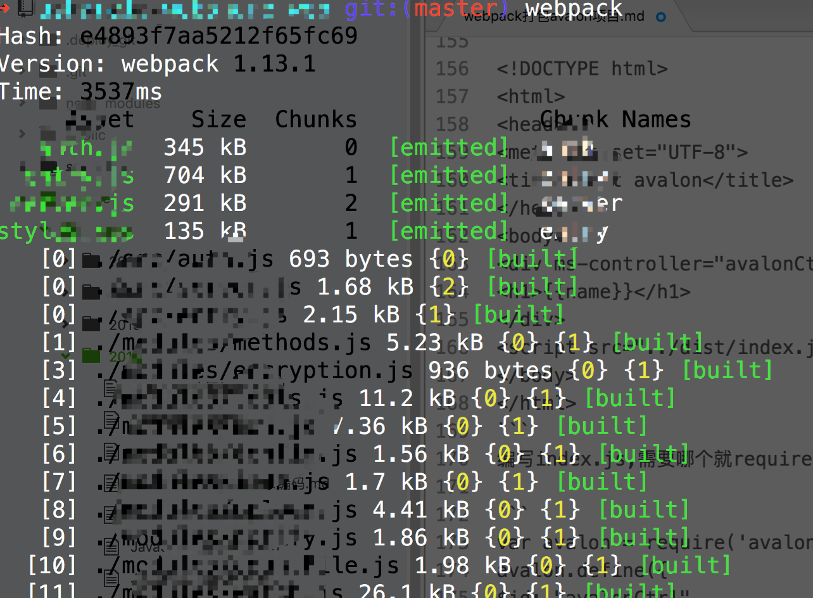

>最近项目需要做一个小巧的web应用，所以用了avalon，并用webpack管理代码

安装过程就不在赘述，可以看[webpack的安装](http://webkong.cn/2016/webpack%E5%AE%89%E8%A3%85/)

1. 安装webpack
2. 新建项目目录

```
├── package.json              # 项目配置
├── index.html                # 入口文件1
├── index2.html               # 入口文件2
├── source                    # 资源目录
│   ├── css/                  # css资源
│   ├── img/                  # 图片资源
├── src/                      #  入口js
│   ├── index.js
│   ├── index2.js
├── modules                   # js模块
├── template                  # html模板文件
├── webpack.config.js         # webpack配置入口
```

3. 使用 `npm init` 新建一个package.json来管理依赖

```
//可以复制，然后执行 npm install
{
  "name": "",
  "version": "1.0.0",
  "description": "",
  "main": "index.js",
  "scripts": {
    "test": "echo \"Error: no test specified\" && exit 1"
  },
  "keywords": [
    "web",
  ],
  "author": "",
  "license": "ISC",
  "devDependencies": {
    "autoprefixer": "^6.3.7",
    "autoprefixer-loader": "^3.2.0",
    "css-loader": "^0.23.1",
    "extract-text-webpack-plugin": "^1.0.1",
    "file-loader": "^0.8.5",
    "html-loader": "^0.4.3",
    "imports-loader": "^0.6.5",
    "less": "^2.7.1",
    "less-loader": "^2.2.3",
    "node-sass": "^3.8.0",
    "sass-loader": "^4.0.0",
    "style-loader": "^0.13.1",
    "text-loader": "0.0.1",
    "transfer-webpack-plugin": "^0.1.4",
    "url-loader": "^0.5.7",
    "webpack": "^1.13.1",
    "webpack-dev-server": "^1.14.1"
  },
  "dependencies": {
    "avalon2": "^2.1.5",
    "jquery": "^3.1.0",
    "jquery.qrcode": "^1.0.3"
  }
}

```
4. 配置webpack

```
//新建webpack.config.js

var webpack = require("webpack");
var path = require("path");
var ExtractTextPlugin = require("extract-text-webpack-plugin"); //单独打包插件
var TransferWebpackPlugin = require('transfer-webpack-plugin');//复制文件插件
module.exports = {
    devtool: false,
    entry: {
        entry: "./src/entry.js",//入口1
        entry2: "./src/entry2.js"//入口2
    },
    output: {
        path: __dirname + "/dist/",
        filename: "[name].js"
    },
    module: {
        loaders: [{
            test: /\.css$/,
            //loader: "style-loader!css-loader?modules"
            loader: ExtractTextPlugin.extract("style-loader", "css-loader")
        }, {
            test: /\.(jpg|png)$/,
            loader: "url?limit=8192"
        }, {
            test: /\.scss$/,
            //loader: "style!css!sass"
            loader: ExtractTextPlugin.extract('style', 'css!sass')
        },{
            test: /\.less$/,
            loader: "style!css!less"
        },{
            test: /\.html$/,
            loader: "html?attrs=img:src img:data-src"
        },
        { test: /\.(woff|ttf|eot|woff2)$/, loader: "file-loader"}

        ]
    },

    resolve: {
        extension: ['', '.js', '.css','.html','.scss'],
        alias: {
            avalon: ("avalon2"),
            //avalon: path.join(__dirname, "./node_modules/avalon2/dist/avalon.js")
            jquery: ("jquery"),
        }
    },
    plugins: [
        new webpack.ProvidePlugin({ //将jQuery设置成全局变量
            $: "jquery",
            jQuery: "jquery",
            "window.jQuery": "jquery",
            "window.$": "jquery"
        }),
        new ExtractTextPlugin("styles.css"),
        new TransferWebpackPlugin([
          {from: '',to:''}
        ], path.resolve(__dirname,'')),//copy
        new webpack.optimize.UglifyJsPlugin({
          compress: {
            warnings: false
          }
        })//压缩js

    ]
}

```
5. 使用
在index.html 引用 /dist/index.js

```
<!DOCTYPE html>
<html>
<head>
<meta charset="UTF-8">
<title>test avalon</title>
</head>
<body>
<div ms-controller="avalonCtrl">
<h1>{{name}}</h1>
</div>
<script src="./dist/index.js"></script>
</body>
</html>
```
编写index.js,需要哪个就require进来

```
var avalon = require('avalon');
avalon.define({
$id: "avalonCtrl",
name: "Hello world!"
});
$("<div>这是jquery生成的,看看avalon好使不</div>").appendTo("body")
```

6. 编写完成后，在终端进入到项目路径下，执行打包指令` webapck `


7. 启动webpack-dev-server,访问http://localhost:8080/webpack-dev-server/index.html

>现在已经成功打包了avalon


## 配置文件详解

```
module: {
    loaders: [{
        test: /\.css$/,
        //loader: "style-loader!css-loader?modules"
        loader: ExtractTextPlugin.extract("style-loader", "css-loader")
    }, {
        test: /\.(jpg|png)$/,
        loader: "url?limit=8192"
    }, {
        test: /\.scss$/,
        //loader: "style!css!sass"
        loader: ExtractTextPlugin.extract('style', 'css!sass')
    },{
        test: /\.less$/,
        loader: "style!css!less"
    },{
        test: /\.html$/,
        loader: "html?attrs=img:src img:data-src"
    },
    { test: /\.(woff|ttf|eot|woff2)$/, loader: "file-loader"}

    ]
},
```
配置文件中的loader，用来将各种文件一起打包在一起，css,js,scss,html等文件打包到一起
可以去官网查看具体的loader
[http://webpack.github.io/docs/list-of-plugins.html](http://webpack.github.io/docs/list-of-p

可以查看[webpack配置jQuery插件](http://webkong.cn/2016/webpack配置（jQuery+jq插件）/)
