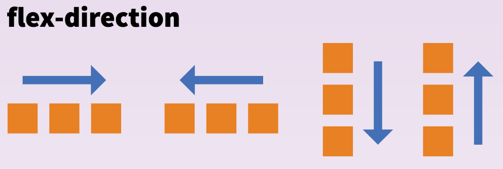
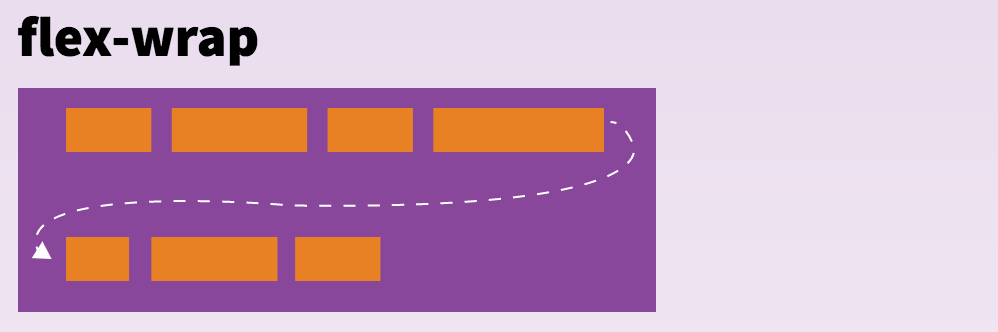
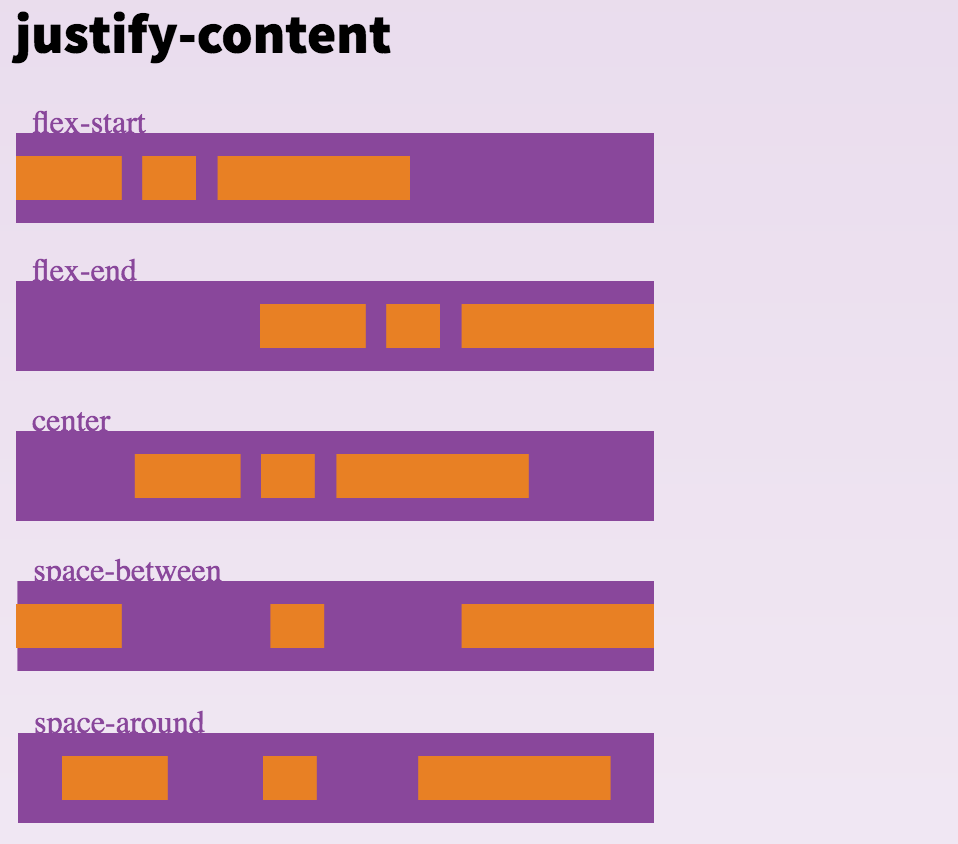
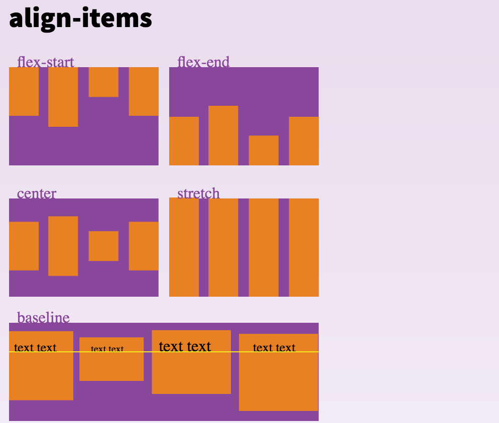
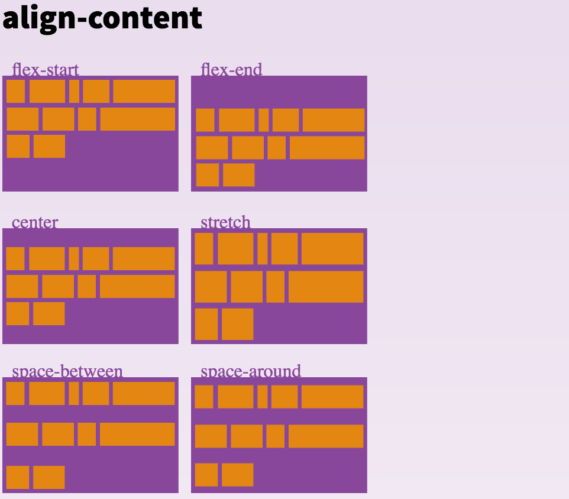
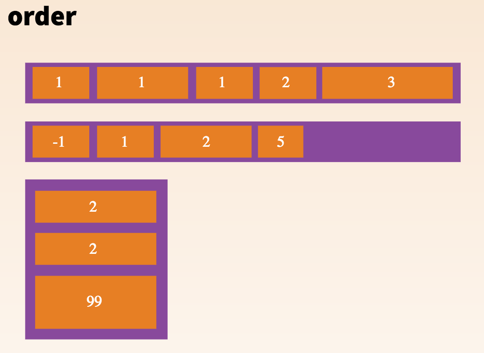
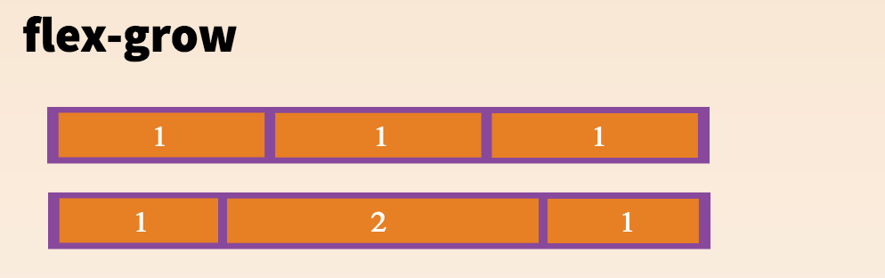
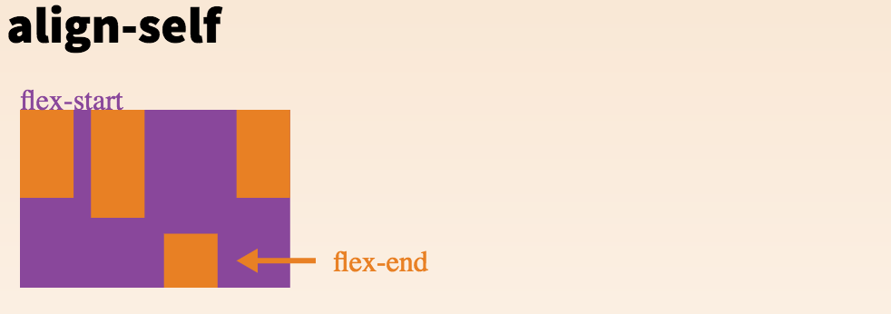
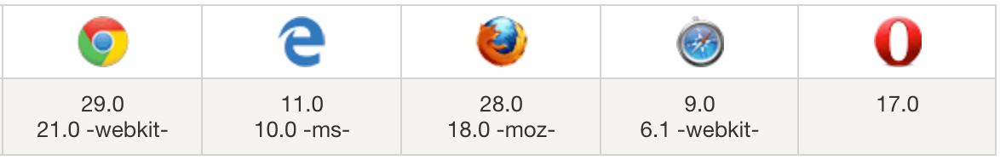

### 前言

> Flex弹性布局， 友好、方便的布局方案。它已经得到了所有浏览器的支持，这意味着，只要带上前缀就可以在所有的浏览器上使用，而不用担心兼容性的问题。
> 布局的传统解决方案，基于盒状模型，将display属性 + position属性 + float属性组合。它对于特殊布局比如垂直居中就不容实现。
> 流行的UI框架的栅格布局也是基于盒模型，通过设置百分比和float来构建的。
> 非常流行的Bootstrap 4.x就是用flex来重新布局的，替代了之前的栅格百分比的布局方式。
> Marked it afraid forgot.

<!-- more -->
### What？ Flex是什么

Flex是Flexible Box的缩写，意为"弹性布局"，用来为盒状模型提供最大的灵活性。
Flex,从2007年07月，flex第一版本的工作草案发布，到2012年09月，flex最新版本成为候选推荐。flex主要经历了三个版本

【1】旧版本 display:box | inline-box;

　　 IE浏览器不支持，windows下的safari浏览器只支持旧版本的写法且需要添加前缀，移动端可以兼容到andriod2.1-4.3和ios3.2-6.1也需要添加前缀

【2】混合版本 display:flexbox | inline-flexbox;

　　该版本只有IE10支持，且需要添加前缀-ms-

【3】新版本 display: flex | inline-flex

　　该版本兼容IE11+、firefox、safari、chrome、opera及移动端，但移动端ios7.1-8.4需要添加前缀-webkit-

目前个浏览器对最新版本有了很好的支持。

```
// 可以对每一个容器都可以指定为flex属性

.box{
  display: flex | inline-flex
}
```
不同的浏览器要加上其特定的前缀：  -webkit-, -ms- 或 -moz-

### How？ 如何加持到容器
Properties for the Parent

flex容器有6个可设置属性（带图一目了然）：
* flex-direction 决定主轴的方向（即容器内项目的排列方向）
* flex-wrap 容器内的项目是否换行，如何换行
* flex-flow 上面两个属性的组合
* justify-content 容器内项目的水平方向的对齐方式
* align-items 容器内项目的垂直方向的对齐方式
* align-content


#### flex-direction
```
.box {
  flex-direction: row | row-reverse | column | column-reverse;
}

row（默认值）：当`ltr`时，从左到右，当`rtl`时，从右向左，也就是按照文档流横向排列。
row-reverse：和row相反。
column：从上到下。
column-reverse：和column相反。
```


#### flex-wrap
```
.box{
  flex-wrap: nowrap | wrap | wrap-reverse;
}

nowrap: 默认， 不换行
wrap: 换行，按照顺序每行依次排列（第一行，第二行）
wrap-reverse: 换行，每行倒序排列(第二行，第一行)
```


#### flex-flow
flex-flow属性是flex-direction属性和flex-wrap属性的简写形式，默认值为row nowrap。
```
.box {
  flex-flow: <flex-direction> || <flex-wrap>;
}
```

#### justify-content
```
.box {
  justify-content: flex-start | flex-end | center | space-between | space-around;
}

flex-start（默认值）：左对齐
flex-end：右对齐
center： 居中对齐
space-between：两端对齐，项目之间的间隔都相等。
space-around：每个项目两侧的间隔相等。所以，项目之间的间隔比项目与边框的间隔大一倍。
```


#### align-items
```
.box {
  align-items: flex-start | flex-end | center | baseline | stretch;
}

flex-start：顶端对齐。
flex-end：底部对齐。
center：居中对齐。
baseline: 项目的第一行文字的基线对齐。
stretch（默认值）：如果项目未设置高度或设为auto，将占满整个容器的高度。
```


#### align-content
类似于justify-content的对齐方式， 针对多行生效，只有一行时不生效
```
.box {
  align-content: flex-start | flex-end | center | space-between | space-around | stretch;

flex-start：顶端对齐
flex-end：低端对齐
center：居中。
space-between：与交叉轴两端对齐，轴线之间的间隔平均分布。
space-around：每根轴线两侧的间隔都相等。所以，轴线之间的间隔比轴线与边框的间隔大一倍。
stretch（默认值）：拉伸占据整个容器的高度。
}
```


>上面的6个属性都是设置在容器上的，针对项目占据容器的大小和顺序等由已下6个属性来设置。

### How flexible？更灵活的设置Children
Properties for the Children
* order  flex子项顺序
* flex-grow flex子项占用容器可用空间的比例
* flex-shrink flex子项在空间不足时缩小
* flex-basis 定义flex子项的默认大小
* flex 以上三个 flex-grow, flex-shrink, flex-basis的简写或者说是组合
* align-self

#### order
默认情况下，flex项目按代码书写顺序布局。但是，order属性控制它们在flex容器中显示的顺序。
```
.item {
  order: <integer>; //整数
}
```


#### flex-grow
如果所有项目的flex-grow属性都为1，则它们将等分剩余空间（如果有的话）。如果一个项目的flex-grow属性为2，其他项目都为1，则前者占据的剩余空间将比其他项多一倍。
```
.item {
  flex-grow: <number>; /* default 0 */
}
```


#### flex-shrink
如果所有项目的flex-shrink属性都为1，当空间不足时，都将等比例缩小。如果一个项目的flex-shrink属性为0，其他项目都为1，则空间不足时，前者不缩小。
```
.item {
  flex-shrink: <number>; /*默认为1 不能是负数*/
}
```
#### flex-basis
```
.item {
  flex-basis: <length> | auto; /* 默认是 auto */
}
length可以是20%, 5rem，10px等长度值
```
#### flex
```
.item {
  flex: none | [ <'flex-grow'> <'flex-shrink'>? || <'flex-basis'> ]
}
默认值是  0 1 auto. 后两个是可选项
```

#### align-self

align-self属性允许单个项目有与其他项目不一样的对齐方式，可覆盖align-items属性。默认值为auto，表示继承父元素的align-items属性，如果没有父元素，则等同于stretch。

```
.item {
  align-self: auto | flex-start | flex-end | center | baseline | stretch;
}
```


### Where？哪里能用




>### 推荐

最后推荐一个淘宝的弹性布局方案

[https://github.com/amfe/lib-flexible](https://github.com/amfe/lib-flexible)

[http://www.cnblogs.com/lyzg/p/5058356.html](http://www.cnblogs.com/lyzg/p/5058356.html)

>### 参考

[https://css-tricks.com/snippets/css/a-guide-to-flexbox/](https://css-tricks.com/snippets/css/a-guide-to-flexbox/)
[http://www.cnblogs.com/xiaohuochai/p/5323146.html](http://www.cnblogs.com/xiaohuochai/p/5323146.html)
