## What is pwa?

Progressive Web App, 简称 PWA，是提升 Web App 的体验的一种新方法，能给用户原生应用的体验。

PWA 能做到原生应用的体验不是靠特指某一项技术，而是经过应用一些新技术进行改进，在安全、性能和体验三个方面都有很大提升，PWA 本质上是 Web App，借助一些新技术也具备了 Native App 的一些特性，兼具 Web App 和 Native App 的优点。

技术依赖:

* Service Worker
* Web storage（IndexedDB, Caches）
* Fetch
* Promises

<!-- more -->

## PWA advantages

PWA应用应该是：

* discoverable 可发现, 可以被识别为应用程序，通过搜索引擎容易找到
* installable 可安装，可用于移动设备，添加到用户主屏幕
* linkable 可连接 通过URL共享，无需复杂安装
* network independent 网络独立 可工作在离线或者低速的网络环境
* progressive 渐进增强 适用于所有用户，支持的浏览器可以体验更好，不支持的浏览器访问不会邮到影响
* re-engageable 再参与 通过提醒，让用户容易进行参与
* responsive 响应式 适合任何形式的设备
* safe 安全 内容传递机制可以防止监听，并保证内容不被篡改

[Progressive web app advantages](https://developer.mozilla.org/en-US/docs/Web/Apps/Progressive/Advantages). To find out how to implement PWAs, consult the guides listed in the below section.

## Progressive(渐进性)

强调是渐进式的，改造过程中可以逐步进行，降低站点的改造成本，新技术支持程度不完整，跟着新技术逐步进化。
PWA 涉及到从安全、性能和体验等方面的优化，可以考虑以下步骤：


* 第一步，应该是安全，将全站 HTTPS 化，因为这是 PWA 的基础，没有 HTTPS，就没有 Service Worker
* 第二步，应该是 Service Worker 来提升基础性能，离线提供静态文件，把用户首屏体验提升上来
* 第三步，App Manifest，这一步可以和第二步同时进行
* 后续，再考虑其他的特性，离线消息推送等

## 支持程度/覆盖率

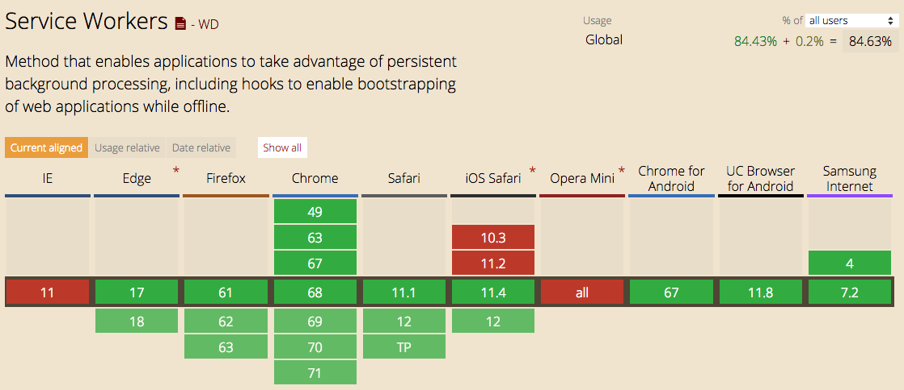

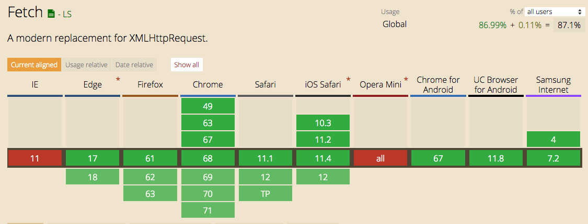

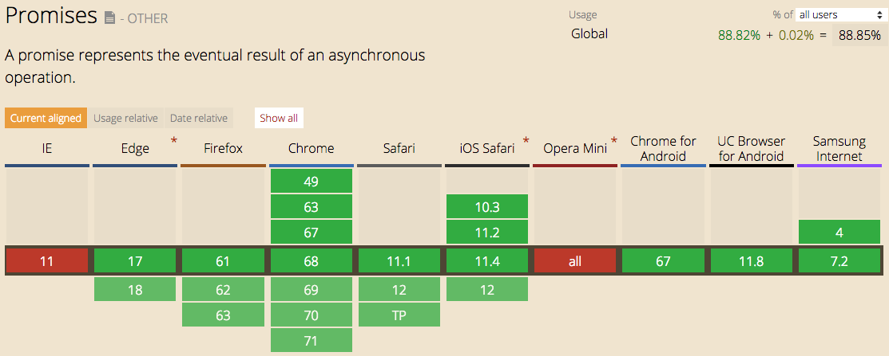

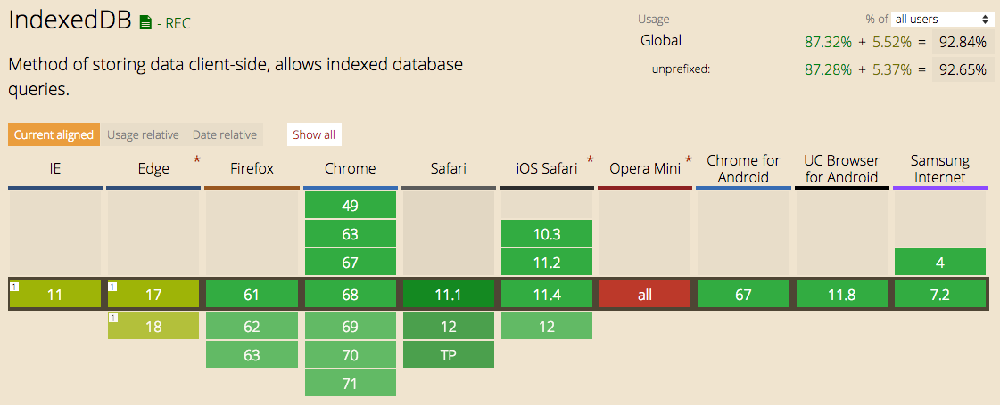

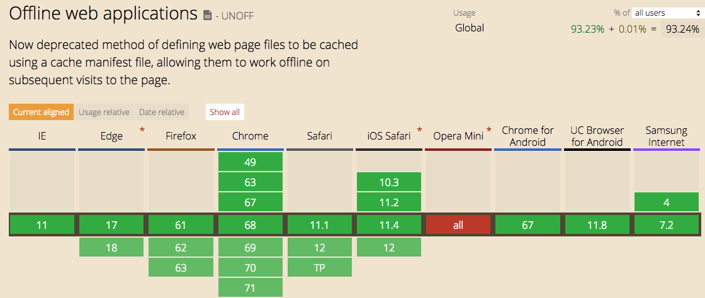

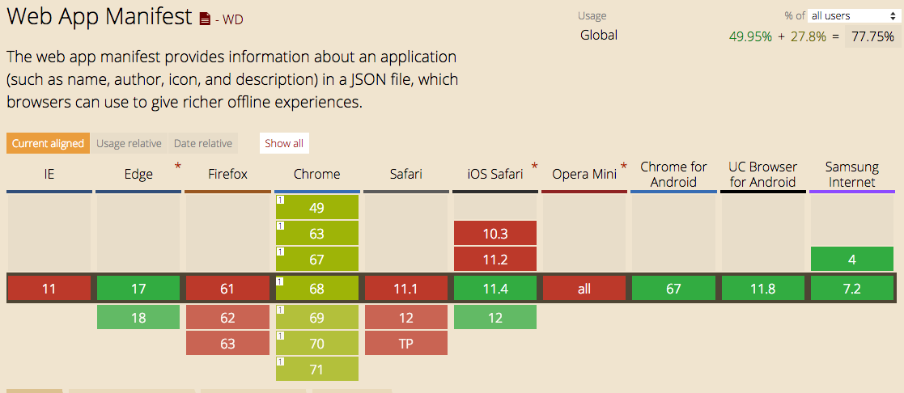

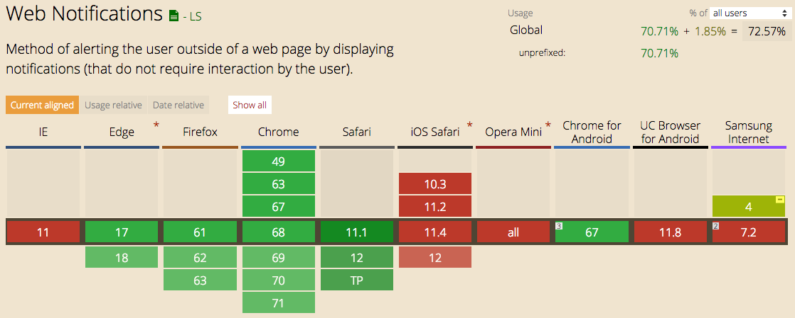

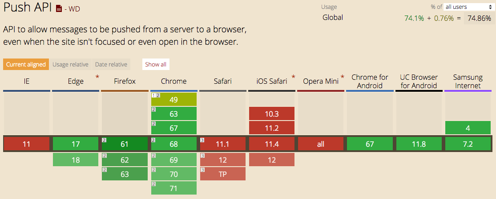

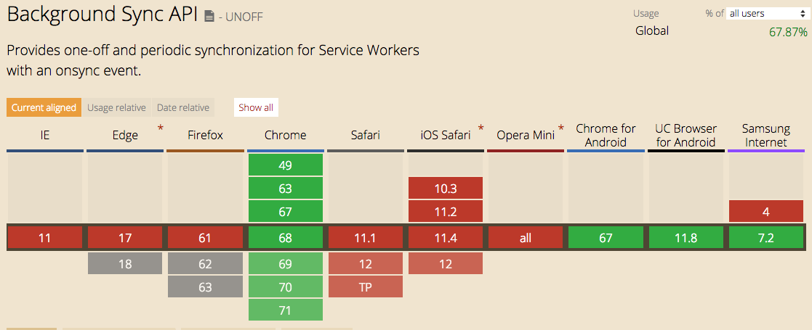


## Service Worker

Service Worker，是一个浏览器和network之间的代理，解决的是如何缓存页面的资产和如果在脱机状态下仍然正常工作的问题。独立于当前网页进程，有自己独立的 worker context，没有对于DOM的访问权限，与传统的API不同，它是非阻塞的，并基于promise方法在就绪时返回结果。它不但只是离线能力，还有消息通知、添加桌面图标等功能。

### 前提条件

* HTTPS， 由于 Service Worker 要求 HTTPS 的环境，我们可以借助 github page 进行学习调试。一般浏览器允许调试 Service Worker 的时候 host 为 localhost。
* Service Worker 的缓存机制是依赖 [Cache API](https://developer.mozilla.org/zh-CN/docs/Web/API/Cach)实现的
* 依赖 [HTML5 fetch API](https://developer.mozilla.org/zh-CN/docs/Web/API/Fetch_API)
* 依赖 [Promise](https://developer.mozilla.org/zh-CN/docs/Web/javaScript/Reference/Global_Objects/Promise) 实现


### Lifecycle

A more detailed introduction to[ The Service Worker Lifecycle](https://developers.google.com/web/fundamentals/primers/service-workers/lifecycle)


A service worker goes through three steps in its lifecycle:

* Registration 注册
* Installation 安装
* Activation 激活

#### 1. 注册

在install Server Worker之前，要在主进程JavaScript代码里面注册它，注册是为了告诉浏览器我们的Servic e Worker文件是哪个，然后在后台，Service Worker就开始安装激活。

>注册代码可以放到html文件的`<script></script>`标签中，也可以单独放到`main.js`文件在引入html文件中。

```JavaScript
if ('serviceWorker' in navigator) {
  navigator.serviceWorker.register('/service-worker.js')
  .then(function(registration) {
    console.log('Registration successful, scope is:', registration.scope);
  })
  .catch(function(error) {
    console.log('Service worker registration failed, error:', error);
  });
}
```
代码中，先检测是浏览器是不是支持Service Worker，如果支持，就用`navigator.serviceWorker.register`注册，如果成功，就会在promise的 `.then` 里面得到`registration`.

service-worker.js文件就是我们要编写Service Worker功能的文件。

注册时，还可以指定可选参数scope，scope是Service Worker 可以以访问到的作用域，或者说是目录。

```JavaScript
navigator.serviceWorker.register('/service-worker.js', {
  scope: '/app/'
});
```
代码中指定作用域是`/app/`,意思就是说，Service Workder 可以控制的path是类似于`app` `/app/home/` `/app/abbout/`等内部目录，而不能访问 `/` '/images'等 `/app`更上一次层的path。

如果Service Worker 已经安装了，再次注册会返回当前活动的registration对象。


chrome浏览器已经很好的支持了Service Worker的debug功能，可在浏览器输入`chrome://inspect/#service-workers`查看是否注册成功了。
或者在控制台的application选项查看。

#### 2.安装

install事件绑定在Service Worker文件中，当安装成功后，install事件就会被触发。
一般我们会在install事件里面进行缓存的处理，用到之前提到的`Cahce API`,它是一个Service Worker上的全局对象<sup>[5]</sup>,可以缓存网络相应的资源，并根据他们的请求生成key，这个API和浏览器标准的缓存工作原理相似，但是只是针对自己的scope域的，缓存会一直存在，知道手动清楚或者刷新。

```JavaScript
var cacheName = 'cachev1'
self.addEventListener('install', function(event) {
  event.waitUntil(
    caches.open(cacheName).then(function(cache) {
      return cache.addAll(
        [
          '/css/bootstrap.css',
          '/css/main.css',
          '/js/bootstrap.min.js',
          '/js/jquery.min.js',
          '/offline.html'
        ]
      );
    })
  );
});
```
1. 新增install的监听器，并用`event.waitUntil()`来确保，Service Worker不会在`waitUntil()`执行完成之前安装完成。
2. 使用`caches.open()`创建一个cachev1的新缓存，返回一个缓存的promise对象，当它resolved时候，我们在then方法里面用`caches.addAll`来添加想要缓存的列表，列表是一个数组，里面的URL是相对于origin的。
3. 如果promise被rejected，安装失败，我们并没有catch，所以并不会做任何事情，也可以修改代码，加上重新注册的代码。
4. 当安装完成时，Service Worker就会激活成功。

#### 3. 激活

当 Service Worker 安装完成后并进入激活状态，会触发 activate 事件。通过监听 activate 事件你可以做一些预处理，如对旧版本的更新、对无用缓存的清理等。

#### Service Worker 如何更新呢？

`service-worker.js`控制着页面资源和请求的缓存，如果 js 内容有更新，当访问网站页面时浏览器获取了新的文件，逐字节比对js 文件发现不同时它会认为有更新启动 [更新算法](https://w3c.github.io/ServiceWorker/#update-algorithm)，于是会安装新的文件并触发 install 事件。但是此时已经处于激活状态的旧的 Service Worker 还在运行，新的 Service Worker 完成安装后会进入 waiting 状态。直到所有已打开的页面都关闭，旧的 Service Worker 自动停止，新的 Service Worker 才会在接下来重新打开的页面里生效。

如果希望在有了新版本时，所有的页面都得到及时自动更新怎么办呢？可以在 install 事件中执行 self.skipWaiting() 方法跳过 waiting 状态，然后会直接进入 activate 阶段。接着在 activate 事件发生时，通过执行 self.clients.claim() 方法，更新所有客户端上的 Service Worker。

```JavaScript
// 安装阶段跳过等待，直接进入 active
self.addEventListener('install', function (event) {
    event.waitUntil(self.skipWaiting());
});

self.addEventListener('activate', function (event) {
    event.waitUntil(
        Promise.all([
            // 更新客户端
            self.clients.claim(),

            // 清理旧版本
            caches.keys().then(function (cacheList) {
                return Promise.all(
                    cacheList.map(function (cacheName) {
                        if (cacheName !== 'cachev1') {
                            return caches.delete(cacheName);
                        }
                    })
                );
            })
        ])
    );
});
```
当js 文件可能会因为浏览器缓存问题，当文件有了变化时，浏览器里还是旧的文件。这会导致更新得不到响应。如遇到该问题，可尝试这么做：在 Web Server 上添加对该文件的过滤规则，不缓存或设置较短的有效期。

或者手动调用`update()`来更新

```JavaScript
navigator.serviceWorker.register('/service-worker.js').then(reg => {
  // sometime later…
  reg.update();
});
```
可以结合localStorage来使用，不必每次加载更新

```JavaScript
var version = 'v1';

navigator.serviceWorker.register('/service-worker.js').then(function (reg) {
    if (localStorage.getItem('sw_version') !== version) {
        reg.update().then(function () {
            localStorage.setItem('sw_version', version)
        });
    }
});
```


**示意图**
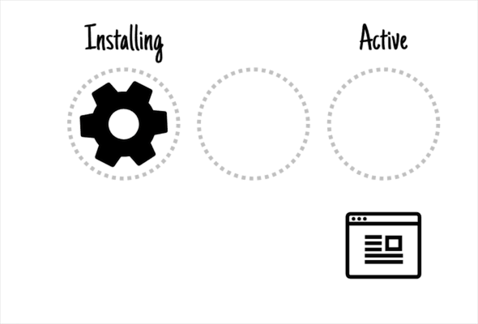

每个状态都会有`ing`,进行态。

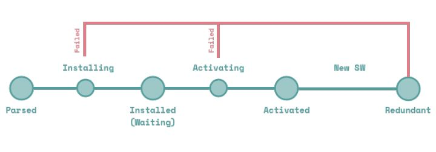


### Web Storage

选择正确的存储机制对于本地设备存储和基于云的服务器存储都非常重要。 良好的存储引擎可确保以可靠的方式保存信息，并减少带宽和提升响应能力。正确的存储缓存策略是实现离线移动网页体验的核心构建基块。

存储的类别，存储的持久化，浏览器支持情况等原因，如何更高效的存储是我们讨论的重点。

#### 资料

[Web Storage Overview](https://developers.google.cn/web/fundamentals/instant-and-offline/web-storage/)

[Using Cache API](https://developers.google.cn/web/fundamentals/instant-and-offline/web-storage/cache-api)

[Offine Storage for PWA](https://developers.google.cn/web/fundamentals/instant-and-offline/web-storage/offline-for-pwa)

[Best Practices for Using IndexedDB](https://developers.google.cn/web/fundamentals/instant-and-offline/web-storage/indexeddb-best-practices)

[Inspect and Manage Storage, Databases, and Caches](https://developers.google.cn/web/tools/chrome-devtools/manage-data/local-storage)

#### cache API和 IndexedDB

针对于离线存储数据,建议可以有:

* 对于网址可寻址的资源，使用[Cache API]() (Service Worker 的一部分)
* 对于所有其他数据，使用[IndexedDB}(https://developer.mozilla.org/en-US/docs/Web/API/IndexedDB_API) (就有一个promise包装器)

基本原理

上面的两个API都是异步的（IndexedDB是基于事件的，而Cache API是基于Promise的）。他们可以与`web Workers` `windows` `service workers`一起使用。IndexedDB基本可以在所有浏览器环境使用（参看上面的CanIUse），Service Wokers和Cahce API的支持情况，可以通过上面的图看到，已经支持Chrome，Firefox，Opera。IndexedDB的Promise包装器隐藏了IndexedDB库自带的一些强大但同时非常复杂的machinery（例如：事务处理 transactions，架构版本schema versioning）。IndexedDB将支持observers，这个特性可以轻松实现标签之间的同步。

对于PWA，我们可以缓存静态资源，从而使用 Cache API 编写的应用 Application Shell（JS/CSS/HTML 文件），并从 IndexedDB 填充离线页面数据。

对于Web Storage（LocalStorage/SessionStorage）是同步的，不支持 Web worker线程，并且有大小和类型（仅限字符串）的限制。

### 添加到桌面

允许将站点添加至主屏幕，是 PWA 提供的一项重要功能。虽然目前部分浏览器已经支持向主屏幕添加网页快捷方式以方便用户快速打开站点，但是 PWA 添加到主屏幕的不仅仅是一个网页快捷方式，它将提供更多的功能，让 PWA 具有更加原生的体验。

PWA 添加至桌面的功能实现依赖于 `manifest.json`。

为了实现 PWA 应用添加至桌面的功能，除了要求站点支持 HTTPS 之外，还需要准备 manifest.json 文件去配置应用的图标、名称等信息。举个例子，一个基本的 manifest.json 应包含如下信息：

```
{
    "name": "Easyify Docs",
    "short_name": "Easyify Docs",
    "start_url": "/",
    "theme_color": "#FFDF00",
    "background_color": "#FFDF00",
    "display":"standalone",
    "description": "A compilation tools for FE, built with webpack4.x, compile faster and smart, make work easier.",
    "icons": [
      {
        "src": "./_assets/icons/32.png",
        "sizes": "32x32",
        "type": "image/png"
      }
    ],
    ...
  }

```
使用 link 标签将 manifest.json 部署到 PWA 站点 HTML 页面的头部，如下所示：

```
<link rel="manifest" href="path-to-manifest/manifest.json">
```
参数解释：

```
name: {string} 应用名称，用于安装横幅、启动画面显示
short_name: {string} 应用短名称，用于主屏幕显示
icons: {Array.<ImageObject>} 应用图标列表
    src: {string} 图标 url
    type {string=} 图标的 mime 类型，非必填项，该字段可让浏览器快速忽略掉不支持的图标类型
    sizes {string} 图标尺寸，格式为widthxheight，宽高数值以 css 的 px 为单位。如果需要填写多个尺寸，则使用空格进行间隔，如"48x48 96x96 128x128"
start_url: {string=} 应用启动地址
scope: {string} 作用域
    // scope 应遵循如下规则：

    //如果没有在 manifest 中设置 scope，则默认的作用域为 manifest.json 所在文件夹；
    //scope 可以设置为 ../ 或者更高层级的路径来扩大PWA的作用域；
    //start_url 必须在作用域范围内；
    //如果 start_url 为相对地址，其根路径受 scope 所影响；
    //如果 start_url 为绝对地址（以 / 开头），则该地址将永远以 / 作为根地址；
background_color: {Color} css色值 可以指定启动画面的背景颜色。
display: {string} 显示类型
    //fullscreen	应用的显示界面将占满整个屏幕
    //standalone	浏览器相关UI（如导航栏、工具栏等）将会被隐藏
    //minimal-ui	显示形式与standalone类似，浏览器相关UI会最小化为一个按钮，不同浏览器在实现上略有不同
    //browser	浏览器模式，与普通网页在浏览器中打开的显示一致
orientation: string 应用显示方向
    //orientation属性的值有以下几种：
    //landscape-primary
    //landscape-secondary
    //landscape
    //portrait-primary
    //portrait-secondary
    //portrait
    //natural
    //any
theme_color: {Color} // css色值theme_color 属性可以指定 PWA 的主题颜色。可以通过该属性来控制浏览器 UI 的颜色。比如 PWA 启动画面上状态栏、内容页中状态栏、地址栏的颜色，会被 theme_color 所影响。
related_applications: Array.<AppInfo> 关联应用列表 可以引导用户下载原生应用
    platform: {string} 应用平台
    id: {string} 应用id
```

### Push Notifications

我们都是通知就是在我们设备上弹出的消息。通知可以是本地触发的，也可以是服务器推送的，而且我们的应用当时并没有运行。消息推送可以使App的更新提醒，也可能是我们感兴趣的内容。

当我们的web可以实现push的时候，web的体验就里Native APP更近一步了。

Push Notifications 由两个API构成：

* Notifications API 用来显示系统的通知
* Push API 用来处理Server下发的push消息

这两个API都是建立在在Service Worker API基础上的，Service Worker 在后台响应推送消息时间，并把他们传递给应用。

>Notification

#### 获取许可

在创建通知之前，应该先获取用户的许可：

```JavaScript
// main.js
Notification.requestPermission(function(status) {
    console.log('Notification permission status:', status);
    //status 会有三个取值default granted denied 分别代表： 默认值（每次访问页面都询问）、 允许、拒绝
});
```
#### 添加通知
获取到用户的许可之后，就可以通过 [`showNotification()`](https://developer.mozilla.org/en-US/docs/Web/API/ServiceWorkerRegistration/showNotification)方法来限制主应用程序的通知。

```JavaScript
// main.js
function displayNotification() {
  if (Notification.permission == 'granted') {
    navigator.serviceWorker.getRegistration().then(function(reg) {
      reg.showNotification('Hello world!');
    });
  }
}
```
要注意`showNotification`，在Service Woker注册对象上调用该方法。将在活动Service Worker上创建通知，以便监听与通知交互触发的事件。

`showNotification`方法有可选项参数`options`，用于配置通知。

```JavaScript
// main.js
function displayNotification() {
  if (Notification.permission == 'granted') {
    navigator.serviceWorker.getRegistration().then(function(reg) {
      var options = {
        body: 'Here is a notification body!', // 对通知添加描述
        icon: 'images/example.png', // 添加一个icon图像
        vibrate: [100, 50, 100], // 指定通知的电话振动模式，手机将振动100ms，暂停50ms，再次振动100ms
        data: {
          dateOfArrival: Date.now(),
          primaryKey: 1
        }, // 给通知添加自定义数据，当监听到通知的时候，可以捕获到这些数据，方便使用。
        actions: [
          {action: 'explore', title: 'Explore this new world',
            icon: 'images/checkmark.png'},
          {action: 'close', title: 'Close notification',
            icon: 'images/xmark.png'},
        ] // 自定义的操作
     };
      reg.showNotification('Hello world!', options);
    });
  }
}
```

#### 监听事件

用户收到通知之后，通过对通知的操作，就会触发监听的Notifications的相关事件，比如在关闭通知的时候就会有`notificationclose`事件。

```JavaScript
// service-worker.js
self.addEventListener('notificationclick', function(e) {
  var notification = e.notification;
  var primaryKey = notification.data.primaryKey;
  var action = e.action;

  if (action === 'close') {
    notification.close();
  } else {
    clients.openWindow('http://www.example.com');
    notification.close();
  }
});
```

> Push

通知操作要结合push，才能实现与用户的交互，主动通知、提醒用户

#### Push service

每个浏览器都有一个`push service`(推送服务),当用户授权当前网站的push权限的时候，就可以将当前网站订阅到浏览器的`push service`。这就会创建一个订约对象，其中包含推送服务的endpoint和公钥（keys）。当下发push消息的时候，就会发送到endpoint这个URL，并用公钥进行加密，`push service`就会发送到正确的客户端。

推送服务如何知道将消息发送到哪个客户端？端点URL包含唯一标识符。此标识符用于路由您发送到正确设备的消息，并在浏览器处理时标识应处理请求的Service Worker。

推送通知和Service Worker是匹配工作的，所以要求推送通知也必须是HTTPS，这就确保了服务器和push service之间通信是安全的，并且从push service到用户也是安全的。

但是，HTTPS不能确保push service本身是安全的。我们必须确保从服务器发送到客户端的数据不会被任何第三方篡改或直接检查。所以必须加密服务器上的消息。

> 整个发送接收展示的过程
>
>在客户端:
>
>  1.订阅推送服务
>
>  2.将订阅对象发送到服务器
>
>在服务器:
>
>  1.生成给用户下发的数据
>
>  2.使用用户的公钥加密数据
>
>  3.使用加密数据的有效负载将数据发送的endpoint URL
>
>消息将路由到用户的设备。唤醒浏览器，找到正确的Service Worker并调用推送事件。
>
>  1.在推送事件中接收消息数据(如果有)
>
>  2.在推送事件中执行自定义逻辑
>
>  3.显示通知


#### 处理推送事件

当支持推送消息的浏览器收到消息时，它会向Service Worker发送一个`push`事件。我们可以在Service Worker中创建一个       `push`事件监听器来处理消息：

```JavaScript
// service-worker.js

self.addEventListener('push', function(e) {
  var options = {
    body: 'This notification was generated from a push!',
    icon: 'images/example.png',
    vibrate: [100, 50, 100],
    data: {
      dateOfArrival: Date.now(),
      primaryKey: '2'
    },
    actions: [
      {action: 'explore', title: 'Explore this new world',
        icon: 'images/checkmark.png'},
      {action: 'close', title: 'Close',
        icon: 'images/xmark.png'},
    ]
  };
  e.waitUntil(
    self.registration.showNotification('Hello world!', options)
  );
});
```
与之前不同的地方就是，这里监听的是push事件，之前是notification事件，并且，这里用了event.waitUntil方法来延长push事件的生命周期，到showNotification异步操作执行完成。

#### 订阅推送通知


在发送推送消息之前，我们必须首先订阅推送服务。订阅返回订阅对象或者是一个`subscription`。它是整个过程中很关键一个部分，我们才能知道push发送到哪里。

```JavaScript
// main.js
//检查是否订阅了
    if ('serviceWorker' in navigator) {
        navigator.serviceWorker.register('sw.js').then(function (reg) {
                console.log('Service Worker Registered!', reg);

                reg.pushManager.getSubscription().then(function (sub) {
                    if (sub === null) {
                        // Update UI to ask user to register for Push
                        console.log('Not subscribed to push service!');
                    } else {
                        // We have a subscription, update the database
                        console.log('Subscription object: ', sub);
                    }
                });
            })
            .catch(function (err) {
                console.log('Service Worker registration failed: ', err);
            });
    }

    function subscribeUser() {
        if ('serviceWorker' in navigator) {
            navigator.serviceWorker.ready.then(function (reg) {

                reg.pushManager.subscribe({
                    userVisibleOnly: true
                }).then(function (sub) {
                    console.log('Endpoint URL: ', sub.endpoint);
                }).catch(function (e) {
                    if (Notification.permission === 'denied') {
                        console.warn('Permission for notifications was denied');
                    } else {
                        console.error('Unable to subscribe to push', e);
                    }
                });
            })
        }
    }

```

#### Web推送协议

Web Push协议是发送发往浏览器的推送消息的正式标准。它描述了如何创建推送消息，加密推送消息并将其发送到推送消息传递平台的结构和流程。该协议抽象出用户具有哪个消息传递平台和浏览器的细节。

Web Push协议很复杂，但我们不需要了解所有细节。浏览器自动负责使用推送服务订阅用户。作为开发人员，我们的工作是获取订阅令牌，提取URL并向那里发送消息。

```JSON
{"endpoint":"https://fcm.googleapis.com/fcm/send/dpH5lCsTSSM:APA91bHqjZxM0VImWWqDRN7U0a3AycjUf4O-byuxb_wJsKRaKvV_iKw56s16ekq6FUqoCF7k2nICUpd8fHPxVTgqLunFeVeB9lLCQZyohyAztTH8ZQL9WCxKpA6dvTG_TUIhQUFq_n",
"keys": {
    "p256dh":"BLQELIDm-6b9Bl07YrEuXJ4BL_YBVQ0dvt9NQGGJxIQidJWHPNa9YrouvcQ9d7_MqzvGS9Alz60SZNCG3qfpk=",
    "auth":"4vQK-SvRAN5eo-8ASlrwA=="
    }
}
```

通常用VSPID身份验证来识别身份。
直接上一个例子

```JavaScript
//main.js
    var endpoint;
    var key;
    var authSecret;

    // We need to convert the VAPID key to a base64 string when we subscribe
    function urlBase64ToUint8Array(base64String) {
      const padding = '='.repeat((4 - base64String.length % 4) % 4);
      const base64 = (base64String + padding)
        .replace(/\-/g, '+')
        .replace(/_/g, '/');

      const rawData = window.atob(base64);
      const outputArray = new Uint8Array(rawData.length);

      for (let i = 0; i < rawData.length; ++i) {
        outputArray[i] = rawData.charCodeAt(i);
      }
      return outputArray;
    }

    function determineAppServerKey() {
      var vapidPublicKey = 'BAyb_WgaR0L0pODaR7wWkxJi__tWbM1MPBymyRDFEGjtDCWeRYS9EF7yGoCHLdHJi6hikYdg4MuYaK0XoD0qnoY';
      return urlBase64ToUint8Array(vapidPublicKey);
    }

    if ('serviceWorker' in navigator) {
      navigator.serviceWorker.register('sw.js').then(function (registration) {

        return registration.pushManager.getSubscription()
          .then(function (subscription) {

            if (subscription) {
              // We already have a subscription, let's not add them again
              return;
            }

            return registration.pushManager.subscribe({
                userVisibleOnly: true,
                applicationServerKey: determineAppServerKey()
              })
              .then(function (subscription) {

                var rawKey = subscription.getKey ? subscription.getKey('p256dh') : '';
                key = rawKey ? btoa(String.fromCharCode.apply(null, new Uint8Array(rawKey))) : '';
                var rawAuthSecret = subscription.getKey ? subscription.getKey('auth') : '';
                authSecret = rawAuthSecret ?
                  btoa(String.fromCharCode.apply(null, new Uint8Array(rawAuthSecret))) : '';

                endpoint = subscription.endpoint;

                return fetch('http://localhost:3111/register', {
                  method: 'post',
                  headers: new Headers({
                    'content-type': 'application/json'
                  }),
                  body: JSON.stringify({
                    endpoint: subscription.endpoint,
                    key: key,
                    authSecret: authSecret,
                  }),
                })

              });
          });
      }).catch(function (err) {
        // registration failed :(
        console.log('ServiceWorker registration failed: ', err);
      });
    }

```
```JavaScript
// server.js

const webpush = require('web-push');
const express = require('express');
var bodyParser = require('body-parser');
var path = require('path');
const app = express();

// Express setup
app.use(express.static('public'));
app.use(bodyParser.json());
app.use(bodyParser.urlencoded({     // to support URL-encoded bodies
  extended: true
}));

function saveRegistrationDetails(endpoint, key, authSecret) {
  // Save the users details in a DB
}

webpush.setVapidDetails(
  'mailto:contact@deanhume.com',
  'BAyb_WgaR0L0pODaR7wWkxJi__tWbM1MPBymyRDFEGjtDCWeRYS9EF7yGoCHLdHJi6hikYdg4MuYaK0XoD0qnoY',
  'p6YVD7t8HkABoez1CvVJ5bl7BnEdKUu5bSyVjyxMBh0'
);

// Send a message
app.post('/sendMessage', function (req, res) {

  var endpoint = req.body.endpoint;
  var authSecret = req.body.authSecret;
  var key = req.body.key;

  const pushSubscription = {
    endpoint: req.body.endpoint,
    keys: {
      auth: authSecret,
      p256dh: key
    }
  };

  var body = 'Breaking News: Nose picking ban for Manila police';
  var iconUrl = 'https://raw.githubusercontent.com/deanhume/progressive-web-apps-book/master/chapter-6/push-notifications/public/images/homescreen.png';

  webpush.sendNotification(pushSubscription,
    JSON.stringify({
      msg: body,
      url: 'http://localhost:3111/article?id=1',
      icon: iconUrl,
      type: 'actionMessage'
    }))
    .then(result => {
      console.log(result);
      res.sendStatus(201);
    })
    .catch(err => {
      console.log(err);
    });
});

// Register the user
app.post('/register', function (req, res) {

  var endpoint = req.body.endpoint;
  var authSecret = req.body.authSecret;
  var key = req.body.key;

  // Store the users registration details
  saveRegistrationDetails(endpoint, key, authSecret);

  const pushSubscription = {
    endpoint: req.body.endpoint,
    keys: {
      auth: authSecret,
      p256dh: key
    }
  };

  var body = 'Thank you for registering';
  var iconUrl = '/images/homescreen.png';

  webpush.sendNotification(pushSubscription,
    JSON.stringify({
      msg: body,
      url: 'https://localhost:3111',
      icon: iconUrl,
      type: 'register'
    }))
    .then(result => {
      console.log(result);
      res.sendStatus(201);
    })
    .catch(err => {
      console.log(err);
    });

});

// The server
app.listen(3111, function () {
  console.log('Example app listening on port 3111!')
});

```

后面再详细说整个push过程。
也可以看先Google给出的教程描述[https://developers.google.com/web/ilt/pwa/introduction-to-push-notifications#push_api](https://developers.google.com/web/ilt/pwa/introduction-to-push-notifications#push_api)


## 参考
[Progressive Web Apps Training](https://developers.google.com/web/ilt/pwa/)

[App Shell](https://developers.google.cn/web/fundamentals/architecture/app-shell)

[Service Workers: an Introduction](https://developers.google.cn/web/fundamentals/primers/service-workers/)

[MDN Progressive web apps](https://developer.mozilla.org/en-US/docs/Web/Apps/Progressive)

[MDN WorkerGlobalScope](https://developer.mozilla.org/en-US/docs/Web/API/WorkerGlobalScope) <sup>[1]</sup>

[The Service Worker Lifecycle](https://developers.google.com/web/fundamentals/primers/service-workers/lifecycle)

[W3C IndexedDB API 3.0](https://w3c.github.io/IndexedDB/)

[Introduction to Push Notifications](https://developers.google.com/web/ilt/pwa/introduction-to-push-notifications)
