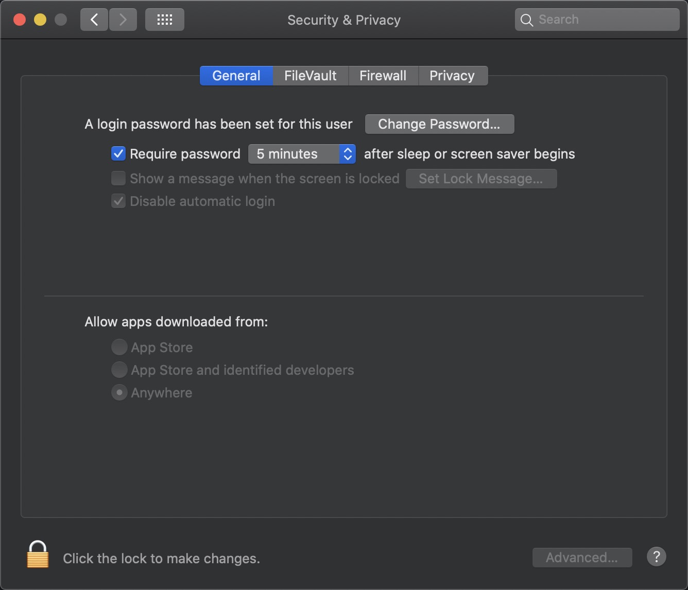

程序安装之后，运行程序提示：

is damaged and can’t be opened. You should move it to the Trash.

<!-- more -->

首先切换到，允许所有开发者

```shell
sudo spctl --master-disable
```



然后打开终端运行：

```shell
xattr -rc /Applications/你的应用.app
```

例如 XMind ZEN

```shell
xattr -rc /Applications/XMind\ ZEN.app

```

应用就可以打开了
