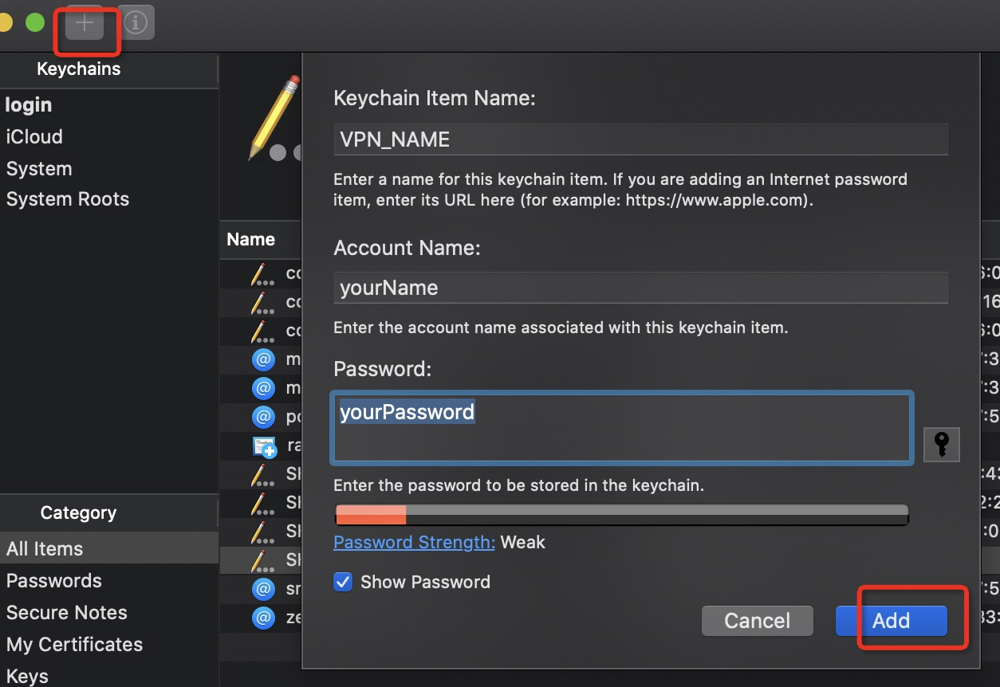

> 抵抗疫情在家办公，科学上网

公司的 VPN 需要使用 Cisco Anyconnect 作为客户端来连接，这个客户端在每次连接的时候需都要输入 LDAP 密码来登录。密码很复杂很是麻烦。可以通过 Anyconnect 提供的命令行工具来实现免密登录。经过网上一番搜集，根据
[https://hiberabyss.github.io/2017/11/27/no-password-anyconnect/](https://hiberabyss.github.io/2017/11/27/no-password-anyconnect/)整理。


<!-- more -->

# 通过命令行连接 VPN

执行命令 `/opt/cisco/anyconnect/bin/vpn -s`

```
$ /opt/cisco/anyconnect/bin/vpn -s
Cisco AnyConnect Secure Mobility Client (version 4.7.01076) .

Copyright (c) 2004 - 2019 Cisco Systems, Inc.  All Rights Reserved.


  >> state: Connected
  >> state: Connected
  >> registered with local VPN subsystem.
VPN>
```

执行`VPN> connect your.vpn.host:port`

```
VPN> connect your.vpn.host:port
connect your.vpn.host:port
  >> state: Connected
  >> notice: Connected to vpn.ushareit.me.
  >> contacting host (your.vpn.host:port) for login information...
```

按照提示输入你的用户名和密码即可连接 VPN .

# 利用脚本连接 VPN（Mac 为例）

VPN 需要知道三个信息：VPN 地址、用户名和密码。 密码是比较私密的信息，不适合放在脚本文件里，我们可以利用 macOS 里的 Keychain 工具来保存密码。

## 创建一个 Keychain password item

打开 Keychain Access 工具，创建一个 VPN_NAME 条目:



当这个条目创建完成，我们便可以利用下面的命令获取密码：

`security find-generic-password -wl VPN_NAME`

## 创建连接 VPN 的脚本文件
下面的 shell 脚本文件会从 Keychain Access 工具里获取 VPN 的密码，然后利用 vpn 命令行工具连接 VPN ，最后打开 Anyconnect 客户端的 UI 界面：

```
#!/bin/bash

KEYCHAIN_LABEL="VPN_NAME"
USERNAME=$(whoami)
PASSWORD=$(security find-generic-password -wl $KEYCHAIN_LABEL)
VPN_URL="your.vpn.url"
VPN_BIN="/opt/cisco/anyconnect/bin/vpn"
ANYCONNECT_PATH="/Applications/Cisco/Cisco AnyConnect Secure Mobility Client.app"

get_anyclient_ui_pid() {
    local pid=$(ps -ef | grep "$ANYCONNECT_PATH" | grep -v 'grep' | awk '{print $2}')
    echo $pid

    if [[ -z "$pid" ]]; then
        return 1
    else
        return 0
    fi
}

kill_anyconnect_ui() {
    $VPN_BIN disconnect
    local pid=$(get_anyclient_ui_pid)
    # echo "PID: $pid"

    if [[ -n "$pid" ]]; then
        kill -9 $pid
    fi
}

open_client_ui() {
    if ! get_anyclient_ui_pid &> /dev/zero; then
        open "$ANYCONNECT_PATH"
    fi
}

connect() {
    # sudo /opt/cisco/anyconnect/bin/vpnagentd
    kill_anyconnect_ui

$VPN_BIN -s << EOF
connect $VPN_URL
$USERNAME
$PASSWORD
y
EOF

    open_client_ui
}

main() {
    if [[ -z "$USERNAME" || -z "$PASSWORD" || -z "$VPN_URL" ]]; then
        echo "Error: empty user info"
        exit 1
    fi

    case "$1" in
        stop|s )
            $VPN_BIN disconnect
            ;;
        * )
            connect
    esac
}

main "$*"
```

把上面的内容保存到`anyconnect`文件中， 给文件加上执行权限 `chmod +x anyconnect`。现在直接执行 anyconnect就可以连上VPN了。

建议文件路径为: `$HOME/bin/anyconnect`。（后面结合 Alfred Workflow 优化效率）。

```
$HOME/bin/anyconnect
Cisco AnyConnect Secure Mobility Client (version 4.7.01076) .

Copyright (c) 2004 - 2019 Cisco Systems, Inc.  All Rights Reserved.


  >> state: Disconnected
  >> state: Disconnected
  >> notice: Ready to connect.
  >> registered with local VPN subsystem.
  >> The VPN client is not connected.


Cisco AnyConnect Secure Mobility Client (version 4.7.01076) .

Copyright (c) 2004 - 2019 Cisco Systems, Inc.  All Rights Reserved.


  >> state: Disconnected
  >> state: Disconnected
  >> notice: Ready to connect.
  >> registered with local VPN subsystem.
VPN> connect your.vpn.url
  >> contacting host (your.vpn.url) for login information...
  >> notice: Contacting your.vpn.url.

  >> Please enter your username.

Username: [your.name] your.name

  >> Please enter your password.
Password: 
  >> state: Connecting
  >> notice: Establishing VPN session...
  >> notice: The AnyConnect Downloader is performing update checks...
  >> notice: Checking for profile updates...
  >> notice: Checking for product updates...
  >> notice: Checking for customization updates...
  >> notice: Performing any required updates...
  >> notice: The AnyConnect Downloader updates have been completed.
  >> state: Connecting
  >> notice: Establishing VPN session...
  >> notice: Establishing VPN - Initiating connection...
  >> notice: Establishing VPN - Examining system...
  >> notice: Establishing VPN - Activating VPN adapter...
  >> notice: Establishing VPN - Configuring system...
  >> notice: Establishing VPN...
  >> state: Connected
VPN> 
[ VPN Connection commands ]
    connect             disconnect        hosts         stats        
    state               block             cancel 

[ Misc commands ]
    help                version           exit

  For help with a specific command, try: help <command>

  >> notice: Connected to your.vpn.url.
  >> state: Connected
VPN> goodbye...
  >> note: VPN Connection is still active.
```

VPN就已经连接成功了。

# 通过 Alfred Workflow 插件来连接

安装这个 [Alfred Workflow](https://github.com/hiberabyss/BlogDATA/raw/master/alfred/NoPasswdAnyconnect.alfredworkflow) 即可直接通过 Alfred 来直接打开或者断开 VPN 连接：


没有任何参数时会连接VPN ，输入参数 s|stop 就会断开 VPN 连接。


